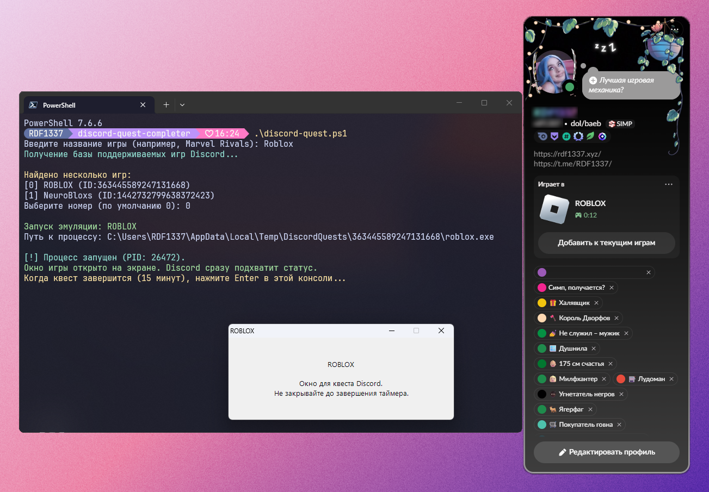

# Discord Quest Completer

A lightweight, standalone Windows CLI utility designed to safely complete Discord Quests without downloading full games or injecting into the Discord client.

<p align="center">
  
</p>

---

### Why is this method safer than DevTools console scripts?

Old JavaScript snippets pasted into DevTools (`Ctrl + Shift + I`) sent spoofed heartbeat and API requests directly through the user's active session. This regularly triggered Discord's automated abuse detection, leading to *"Quest Activity Notice"* warnings or account quest restrictions.

> **How this tool works:**  
> This application does **not** touch Discord's memory, client files, or internal private APIs. It queries Discord's official public detectable games directory (`/api/v9/applications/detectable`), replicates the verified directory structure, and spawns a native GUI dummy window. Discord's desktop client detects it as a genuine running game, enabling both **Play** and **Stream** quest progression without risk.

---

### Features

* **Zero Dependencies:** Fully portable standalone `.exe` – no Python, .NET SDK, or PowerShell script execution rights required.
* **Stream & Play Support:** Generates an authentic GUI game window that can be selected directly in Discord screen share.
* **Rich Dashboard:** Interactive terminal UI featuring real-time progress, PID monitoring, and API status.
* **Dynamic Window Title:** Displays the remaining time directly in the taskbar / terminal tab title.
* **Auto-Termination & Grace Buffer:** Automatically shuts down the dummy process and cleans up temporary files after 15 minutes and 15 seconds (including a buffer for API latency).
* **Process Tree Cleanup:** Automatically kills orphan processes to prevent file lock errors (`[WinError 32]`).

---

### Requirements

* **Windows 10 or Windows 11** (64-bit).
* **Discord Desktop Client** for Windows.

---

### How to Use

1. **Accept the Quest:**  
   Open Discord, go to **User Settings → Quests** (or the **Discover → Quests** tab), and click **Accept Quest**.

2. **Download & Run:**  
   Grab the latest `DiscordQuestCompleter.exe` from the **[Releases](../../releases)** section and run it (either double-click or launch via terminal).

3. **Select the Game:**  
   Type the game name when prompted (e.g., `Apex Legends`, `Marvel Rivals`, or `Aniimo`). The tool will resolve the game ID and executable name from Discord's directory and launch the dummy window.

4. **Complete the Quest:**
   * **Play on Desktop:** Leave the spawned game window open. Discord will automatically track your playtime.
   * **Stream on Desktop:** Join a voice channel with at least one other participant. Start screen sharing and choose the **game window** specifically (do not share the entire desktop).

5. **Finish:**  
   Once the timer runs down, an audio chime will notify you. The application automatically closes the dummy window and wipes temporary data from `%TEMP%`.

6. **Claim Reward:**  
   Head over to **User Settings → Gift Inventory** (or the Quests tab) in Discord and claim your reward.

---

### CLI Options

You can also pass arguments directly (useful for desktop shortcuts):

```cmd
DiscordQuestCompleter.exe "Apex Legends"
DiscordQuestCompleter.exe --game "Marvel Rivals" --duration 915
```

---
### Disclaimer of Liability

This project is intended strictly for educational and personal utility purposes.

* **"AS IS" Warranty:** The software is provided "as is", without warranty of any kind, express or implied, including but not limited to the warranties of merchantability, fitness for a particular purpose, and non-infringement.
* **No Affiliation:** This project is not affiliated with, maintained, authorized, sponsored, or endorsed by Discord Inc. or any of its affiliates.
* **Limitation of Liability:** In no event shall the authors or copyright holders be liable for any claim, damages, account penalties, restrictions, or other liabilities arising from, out of, or in connection with the software or the use or other dealings in the software. You use this tool at your own discretion and risk.
